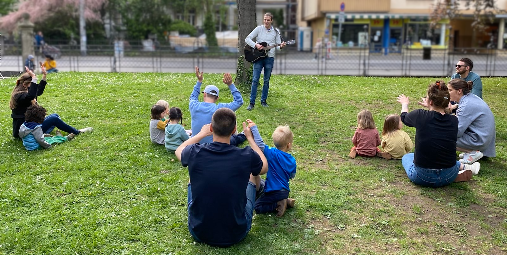

# Heidelberger Westadtwusel

## Was ist Weststadtwusel?
Das Weststadtwusel ist ein angeleiteter Spieletreff für Kinder im Vorschulalter, die zusammen mit ihren Eltern teilnehmen. Es wird unter Anleitung gespielt, gesungen, musiziert, getanzt, geturnt und gewuselt. Der Spieletreff ist kostenlos und wird angeleitet von Samuel Kilian, dessen eigene Tochter auch teilnimmt. Er findet üblicherweise montags 16-17 Uhr im Haus der Christuskirche statt.

## Details
* Termin: Montags 16-17 Uhr. Es findet *nicht* statt in den BW-Sommerferien. Weiterhin können einzelne Termine ausfallen. Bitte immer die aktuelle Terminliste beachten.
* Ort: Haus der Christuskirche, großer Saal im 2. OG (Zähringerstraße 26, 69115 Heidelberg). Achtung: Die Eingangstür darf von außen und innen nur mit den Türöffnern bedient werden und nicht von Hand aufgemacht werden. Ab 16:30 Uhr muss man von innen reingelassen werden.
* Turnschläppchen oder Anti-Rutsch-Socken sind Pflicht, da der Boden sehr rutschig ist.
* Im Anschluss an den offiziellen Teil gibt es meistens ein zwangloses get-together mit mitgebrachten Snacks bis spätestens 18 Uhr für alle Interessierten.
* Kinder müssen zusammen mit einer Betreuungsperson teilnehmen und obliegen vollständig deren Verantwortung.
* Die Gruppengröße ist auf 10 Kinder beschränkt.
* Das Tragen einer Maske ist freiwillig.
* Teilnahme ist nur nach vorheriger Anmeldung und erfolgter Bestätigung möglich. Zu jedem Termin muss sich separat angemeldet werden.
* Träger ist die Christus-Luther-Markus-Gemeinde Heidelberg. Die Veranstaltung hat keine religiösen Inhalte und selbstverständlich ist die Teilnahme von der Religionszugehörigkeit unabhängig.

## Hygieneschutzkonzept
Es gibt kein Hygieneschutzkonzept mehr.

## Nächste Termine
* ~~05.12.2022~~ (fällt aus)
* 12.12.2022
* 19.12.2022
* 09.01.2023

## Wer leitet das Weststadtwusel?
Die Gruppe wird angeleitet von mir, Samuel Kilian. Meine eigene Tochter ist drei Jahre alt und ebenfalls ein Wusel. Ich gründete den Spieletreff im Sommer 2021, nachdem ich erfolglos versuchte, einen Platz im Kinderturnen für meine Tochter zu finden. Ich wohne selbst in der Weststadt und bin mit meiner Tochter öfter auf dem Synagogenspielplatz anzutreffen. Ich arbeite als Statistiker an der Uniklinik, bin Hobby-Musiker und habe keine pädagogische Ausbildung absolviert.

## Anmeldung
Bei Interesse gerne eine E-Mail an mich unter sam<!-- abc@def -->uel@we<!-- @abc.de -->berkil<!-- @abc.de -->ian.de.
